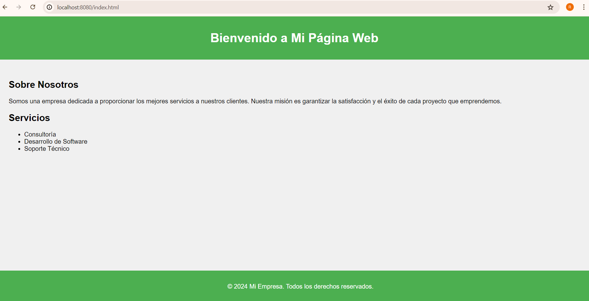
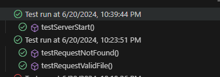
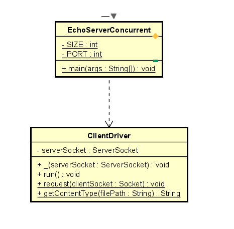

# ConcurrentWebServer

This program implements a basic concurrent web server capable of serving static files and handling multiple requests simultaneously using a thread pool.


For example, a typical invocation would be:
```
java -jar .\target\ARSW-ConcurrentWebServer-1.0-SNAPSHOT.jar  
```

In the following path you will have four files "*index.html*", "*respuesta.html*","*google.jpg*", with which you can test the project.
```
src/main/java/edu/escuelaing/arsw/ASE/app/Files
```

### LOC/h Calculation

To calculate LOC, 105 lines of code are taken into account, in 4 hours. So your productivity for this project is **26,25 LOC/h**.

## Starting

In order to use the project on your system, you can access the following link and download a compressed file of it.

You can also clone the file using the following command.

```
git clone https://github.com/Richi025/ARSW-ConcurrentWebServer.git
```
if you want to run the application use the command.

```
java -jar .\target\ARSW-ConcurrentWebServer-1.0-SNAPSHOT.jar 
```


### Previous requirements

It is necessary to have "**Maven**" and "**Java**" installed, preferably in their latest versions.

### * Maven
```
Download Maven at http://maven.apache.org/download.html 

Follow the instructions at http://maven.apache.org/download.html#Installation
```
### * Java

```
Download Java at https://www.java.com/es/download/ie_manual.jsp
```


### Installing

Once you have the cloned project in your repository. Follow the steps below to launch the program successfully

1. Open a terminal and enter the folder where I clone the repository.

2. Use the following command to compile and clean the target directory.
```
mvn clean compile
```
3. Now use the following command to package the project as a JAR file.

```
mvn package
```

4. Now you can run the project using the following command.

```
java -jar .\target\ARSW-ConcurrentWebServer-1.0-SNAPSHOT.jar 
```

5. Once the program is running, open a browser and enter the following links.

* http://localhost:8080/resultado.html


* http://localhost:8080/index.html



* http://localhost:8080/google.jpg


## Running the tests

To run the tests you can use the following Maven command

```
mvn test
```




## Design

For the design, the following class diagram was made. In which it was considered to have a class for all the methods that are going to perform operations.

The methods considered are the following:

### EchoServerConcurrent

* main: It is the main entry point of a program. It is where the execution of the program begins.

### ClientDriver

* run : The run method is executed when the ClientDriver is submitted to the executor service..

* request : Handles an incoming client request by reading HTTP GET requests and sending appropriate responses.

* getContentType : Determines the content type based on the file extension of the requested resource.




### Phase architecture

To be able to run the application using "*java -jar*" including in the "pom.xml" file and specifying the main class.

```
    <plugins>
      <plugin>
        <groupId>org.apache.maven.plugins</groupId>
        <artifactId>maven-jar-plugin</artifactId>
        <version>3.1.0</version>
        <configuration>
          <archive>
            <manifest>
              <addClasspath>true</addClasspath>
              <mainClass>edu.escuelaing.arsw.ASE.app.StatisticalCalculator</mainClass>
            </manifest>
          </archive>
        </configuration>
      </plugin>
    </plugins>
```
## Built with

* [Maven](https://maven.apache.org/) - Dependency management
* [java](https://www.java.com/es/) - Programming language

## Versioned

We use [Git](https://github.com/) for version control. For available versions, see the tags in this repository.

## Authors

* **Jose Ricardo Vasquez Vega** - [Richi025](https://github.com/Richi025)

## Date

Friday, June 21, 2024

## License

This project is licensed under the GNU license; See the [LICENSE.txt](LICENSE.txt) file for details.